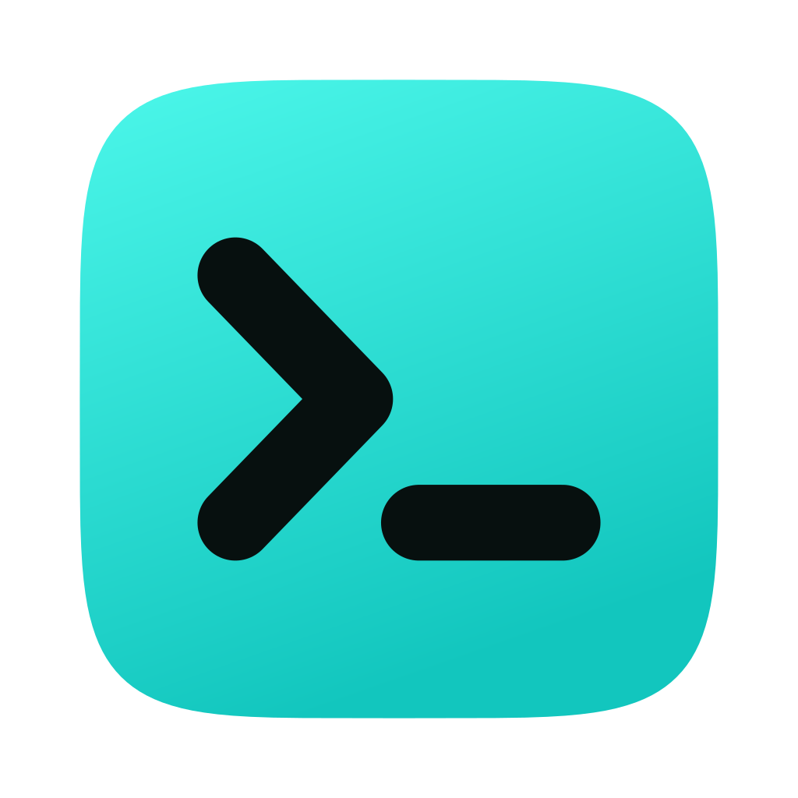
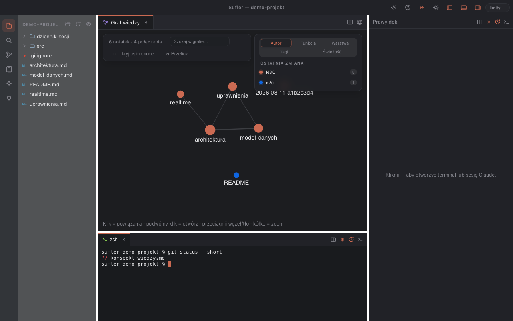

# Sufler

**Podpowiada Claude'owi cały twój projekt.**

Środowisko pracy z Claude Code: edytor, prawdziwe terminale i sesje Claude
w jednym oknie — razem z grafem wiedzy, skillami i serwerami MCP.

[sufler.dev](https://sufler.dev/) · macOS i Windows

### ⬇ [Pobierz najnowszą wersję](https://github.com/Luqys/Sufler/releases/latest)

## Co pobrać

Wszystkie paczki leżą w [Releases](https://github.com/Luqys/Sufler/releases/latest).

| System | Plik |
|---|---|
| macOS (M1–M4) | `Sufler-<wersja>-arm64.dmg` |
| macOS (Intel) | `Sufler-<wersja>-x64.dmg` |
| Windows | `Sufler-Setup-<wersja>-x64.exe` |
| Windows (ARM) | `Sufler-Setup-<wersja>-arm64.exe` |
| Windows bez instalacji | `Sufler-<wersja>-x64-portable.exe` |

Menu  → *Ten Mac* pokazuje, czy masz procesor Apple, czy Intela.

## Instalacja

**macOS.** Otwórz `.dmg` i przeciągnij Sufler do katalogu **Programy**.
Aplikacja nie ma płatnego podpisu Apple Developer ID, więc przy pierwszym
uruchomieniu system poprosi o potwierdzenie: kliknij ikonę prawym przyciskiem
→ **Otwórz** → jeszcze raz **Otwórz**. Jeśli okno nie daje przycisku „Otwórz"
(macOS Sequoia i nowsze), zajrzyj do *Ustawienia systemowe → Prywatność
i ochrona* i kliknij **Otwórz mimo to**. Robi się to raz.

**Windows.** Uruchom instalator. SmartScreen może ostrzec o nieznanym
wydawcy — **Więcej informacji** → **Uruchom mimo to**. Wersja `-portable.exe`
działa bez instalacji.

Ta sama instrukcja czeka w oknie każdego `.dmg`. Krok po kroku, razem
z pierwszymi krokami w aplikacji i rozwiązywaniem problemów:
**[INSTRUKCJA.md](INSTRUKCJA.md)**.

## Czym to jest

Sufler pracuje na tym samym katalogu co Claude Code i pokazuje wszystko, co
asystent widzi po swojej stronie: skille, subagentów, reguły, serwery MCP
i notatki projektu. Zamiast przełączać się między edytorem, terminalem a czatem,
masz je obok siebie — a Claude dostaje pełny kontekst projektu, nie same
fragmenty wklejone do rozmowy.

Pliki zostają na dysku. Aplikacja niczego nie wysyła do sieci poza tym, co robi
samo Claude Code.

## Co potrafi

**Edytor i terminale.** Monaco z zakładkami i podglądem różnic, terminale na
`node-pty` i `xterm.js`. Karta terminala i karta sesji Claude to ta sama karta —
różni je wyłącznie komenda startowa. Karty dzielą się na panele, przenoszą
między dokami i wyjeżdżają do osobnych okien, nie restartując procesów.

**Graf wiedzy.** Notatki markdown połączone wikilinkami `[[…]]`, kolorowane
według autora, funkcji, warstwy, tagów albo świeżości. Do tego szukajka,
filtry legendy i ukrywanie notatek bez połączeń. Claude sięga po ten sam graf
narzędziami MCP, więc sam sprawdza, co jest z czym powiązane.

**Dziennik sesji.** Każda sesja zapisuje przebieg pracy do pliku markdown:
polecenia, edytowane pliki, komendy. Dzięki temu `/clear` przestaje boleć —
wracasz do wątku, czytając jeden krótki plik zamiast odtwarzać rozmowę.
Przycisk „Streść" prosi Claude o podsumowanie na górze dziennika.

**Punkty przywracania.** Przed każdą turą Claude aplikacja zapisuje migawkę
drzewa w osobnym refie gita — bez dotykania twoich commitów, gałęzi i indeksu.
Jedno kliknięcie cofa pliki do wybranego stanu; bieżący stan trafia najpierw do
nowej migawki, więc cofnięcie też da się cofnąć.

**Skille, agenci i reguły.** Przegląd tego, co widzi Claude, z przełącznikami
włącz/wyłącz (zapisywanymi w `.claude/settings.local.json`) i kreatorami nowych.
Sesje Claude mogą tworzyć skille same, przez MCP.

**Limity planu.** Zużycie okna 5-godzinnego i tygodnia prosto z tego samego
źródła, którego używa `/usage`, wraz z prognozą wyczerpania i ostrzeżeniem przy
wysokim zużyciu.

**Historia pracy.** Commity gita i dzienniki sesji na jednej osi czasu — widać,
która rozmowa doprowadziła do której zmiany.

**Reszta.** Serwery MCP ze stanem połączenia, wyszukiwanie ripgrepem, status git
w drzewie, import plików przeciągnięciem z Findera, integracja z Obsidianem,
motywy jasny, ciemny i matrixowy, interfejs po polsku i angielsku.

## Wymagania

- macOS albo Windows
- [Claude Code](https://claude.com/claude-code) w `PATH` — sesje Claude
  i wskaźnik limitów planu
- `git` i `ripgrep` — panel historii, punkty przywracania i wyszukiwanie

Bez Claude Code aplikacja też się uruchomi: dostaniesz edytor, terminale, graf
wiedzy i panele, tylko bez sesji asystenta.

## Licencja

[MIT](LICENSE) — rozwijane przez [N3O System](https://sufler.dev/).
Zbudowane na Electronie, React i TypeScripcie jako wsparcie dla Claude Code.
